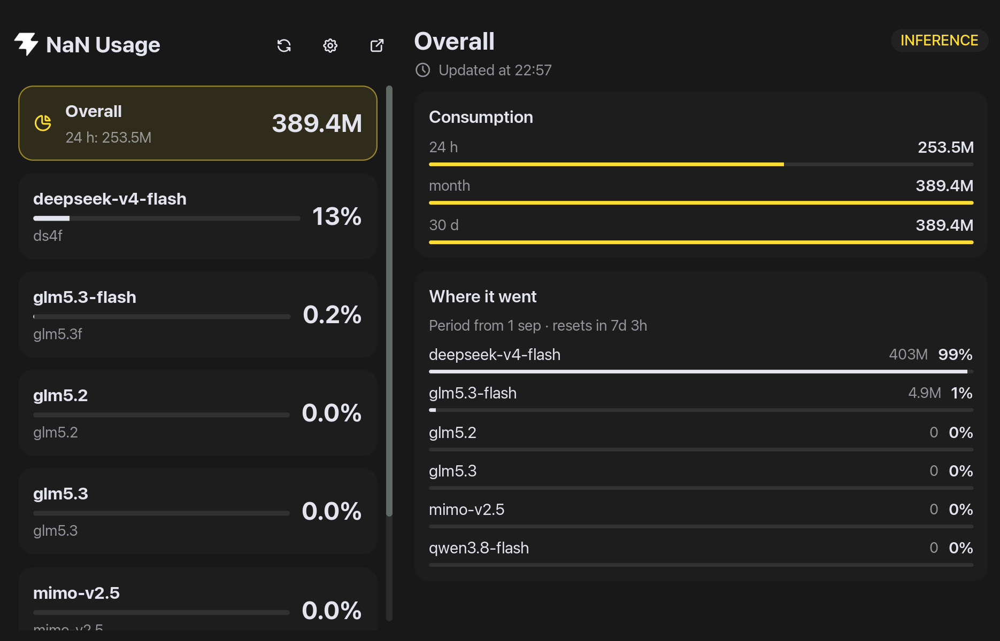
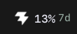
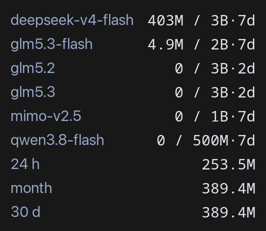

# NaN Usage — a Noctalia plugin

Your NaN (nan.builders) subscription quota in the Noctalia bar: a bar widget showing
the model that is worst off — its percentage, the time to the reset, and a colour that
follows the burn rate rather than the percentage alone — with a panel of per-model
detail behind it. It talks to NaN's cloud API itself, so nothing has to be installed
and no command has to be on `PATH`.

`nan-usage/` is the plugin. Its id is `cmoro-deusto/nan-usage`, and the directory is
named after the part of the id after the slash — the layout a plugin *source* has to
have, and what makes this repository installable as one.



## The widget in the bar

The bar has room for one model — the one worst off — its usage, and the time to the
reset, coloured by how alarming the burn rate is rather than by the percentage alone:



Hovering it lists the values instead, one line per model with tokens used against the
cap and the time to the reset, then one line per period — short enough to read without
leaving the bar:



## Installing it

### As a source, which is the one to use

Noctalia then owns the plugin, so it can update and remove it:

```sh
noctalia msg plugins source add nan-usage git https://github.com/cmoro-deusto/nan-usage-noctalia
noctalia msg plugins enable cmoro-deusto/nan-usage
```

The repository *is* the source; `nan-usage/` inside it is the plugin. To update later,
**Settings → Plugins** → the source's Update.

### From a local checkout

The same thing pointed at a directory you edit, which is how to work on the plugin:

```sh
cd /path/to/nan-usage-noctalia
noctalia msg plugins source add nan-usage path "$PWD"
noctalia msg plugins enable cmoro-deusto/nan-usage
```

`.luau` edits hot-reload; manifest changes are read on the next configuration reload,
which toggling the plugin forces.

### As a drop-in, with no source at all

Noctalia scans `~/.local/share/noctalia/plugins/` read-only, so there is no uninstall
action and the files stay yours:

```sh
cp -r nan-usage ~/.local/share/noctalia/plugins/
```

Then enable it in **Settings → Plugins**.

### After installing, either way

Add the widget from the bar's widget picker, and open the panel from anywhere,
including a compositor key binding:

```sh
noctalia msg panel-toggle cmoro-deusto/nan-usage:panel
```

It needs a NaN API key at `~/.config/nan/api-key` — the same file NaN's own `nan`
command line tool reads, so if you already use that there is nothing to do. Another
path can be set in the plugin's settings. Without a key the widget shows a dash and
the tooltip says which file it wanted.

If your Noctalia's store already lists `cmoro-deusto/nan-usage`, that is the same
plugin, and installing it from there keeps it updated with the rest of your plugins.

## Updating and removing it

- **From a git source**: the source's Update in **Settings → Plugins**, then a
  configuration reload if the manifest changed.
- **Removing**: disable the plugin, then remove the source, or delete
  `~/.local/share/noctalia/plugins/nan-usage/` if you dropped it in by hand.

## The plugin's own page

`nan-usage/README.md` is the page written for someone deciding whether to enable the
plugin: what the colours mean, every setting, and everything it touches — three GETs
to NaN's API per poll, one file read and none written, and one spawned command, only
when the panel's link button is pressed.

## Working on the plugin

```sh
make test
```

which runs the three checks in `nan-usage/tests/`:

- `shared_test.lua` is the model on its own — levels, projections and every text,
  exactly, under a fixed clock — with no host and no stubs at all, because the model
  takes the current time as an argument instead of reading a clock.
- `plugin_test.lua` drives the real `service.luau`, `bar.luau` and `panel.luau`
  against stubs of the Noctalia API and asserts what matters: that the poller reads
  the key, asks its endpoints with it and publishes what came back; that a failed
  poll keeps the last good numbers and says why; that the surfaces paint that data
  without spawning anything; and that a refresh is asked for over the shared state
  channel. Plain Lua 5.4, no dependencies, under a second.
- `plugin_check.py` reads rather than runs: the manifest against its translation
  keys, the plugin directory against its id, and every API member, `ui` control,
  `ui` prop, callback and translation key against Noctalia's own type definitions,
  which it downloads (the check is skipped without network). Needs Python 3.11 or
  newer for its TOML reader.

Both exist because the mistakes that cost the most time in this plugin were
invisible to reading — a first line Luau rejects while `luac` accepts it, a `local`
function called above its own definition, a prop the host keeps because the next
render did not set it.

Two things that are easy to get wrong when editing it: bump `version` in
`plugin.toml` on **every** change, and write `translations/en.json` as nested
objects — a dotted key would be rewritten on the next i18n sync, so `a.b` as a key
silently churns.

## The icons

`nan-usage/nan.svg` is the source of the three rasters the plugin draws — the coloured
mark and a black-on-white/white-on-black ghost pair for the theme. Regenerate them
with `./generate-icons.sh` at the repository root (needs `rsvg-convert`) after
changing the SVG; it writes into `nan-usage/`, which is where the plugin ships them.

They are rasters because whether a Qt build can render SVG depends on its image
plugins being installed, and an icon that silently fails to appear is worse than a
slightly larger file.

## License

MIT — see [LICENSE](LICENSE).
